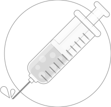

	<embed src="http://iamssen.github.io/reflow.sample.dependency-inection.simple-singleton-model/bin-release/index.swf" width="500" height="300"/>
	

		<a href="http://github.com/iamssen/reflow.sample.dependency-inection.simple-singleton-model" target="_blank"
		   class="btn btn-default btn-xs"><i class="fa fa-code"></i> view source</a>
		<a href="http://github.com/iamssen/reflow" target="_blank" class="btn btn-default btn-xs"><i
				class="fa fa-code-fork"></i> reflow framework</a>
	

<h1>
	

		
		 
		Dependency Injection
	

</h1>

`View`에 `Model`을 주입시키는 예제 입니다.

[Reflow Framework]에서 지원하는 Dependency Injection 기능을 사용 합니다.

	[Inject]
	public var model:Model;

Dependency Injection의 기본적인 사용 방식은 위와 같습니다. `[Inject]` 태그를 적으면 필요한 객체(Object)를 자동으로 주입 받을 수 있습니다.

1. `model = new Model();` 과 같은 생성 코드 필요 없습니다.    
필요할 때 Framework에 의해 자동으로 생성됩니다.
1. `model = view.parent.parent.view1.model;` 이런 물리적인 위치를 찾는 코드 필요 없습니다.   
모든 객체는 Framework가 관리합니다.
1. `model = Model.getInstance();` 이런 `Singleton` 패턴을 사용한 위치 역시 필요 없습니다.

## 예제 상에서의 의존 관계

예제 상에서의 의존 관계는 위와 같습니다.

- `DisplayView`와 `LabelView`는 단순히 `Model`의 데이터를 출력합니다.
- `InputView`는 `Model`의 데이터를 수정할 수 있습니다.

`View`들이 `Model`에 의존적 입니다. (`View`들이 `Model`을 필요로 한다는 뜻이죠.)

## `Model`

`reflow.sample.models.Model`

우선 `Model`을 만들어야 합니다.

## `View`

`reflow.sample.views.DisplayView`

`reflow.sample.views.LabelView`

`reflow.sample.views.InputView`

`[Inject]` 태그를 사용한 `View`들을 만들어줍니다.

`Model`을 가져오거나 생성하는데 필요한 코드를 작성할 필요가 없기 때문에 `View`의 코드는 한결 간단해지게 됩니다. (개별적인 기능들에만 집중 할 수 있습니다.)

## 여기까지는 "분리"의 개념

`MV*` 패턴은 (여러가지 개념들이 뒤섞여있지만, 기본적으로는...) `Model`과 `View`를 분리하기 위해 필요합니다.

사용자들이 직접적으로 보거나, 사용하게 되는 `View`는 

- 서비스의 비지니스 로직 등이 변경되면 `View`는 자연스레 변경될 수 밖에 없고
- 사용자의 기기들이 다양한지라 경우에 따라서는 별도로 만들어줘야 하고
- 사용성이나 (iOS7으로의 변화같은)유행 등에 의해서 디자인은 지속적으로 변경이 이루어지고

변경이 자주 일어나거나, 다수가 될 수 있습니다. 

이렇게 막 변해대는 `View`의 반대 개념을 대략적으로 모아보면

1. 서비스의 핵심적이고, 변하지 않는 사항들이 `Model`과
1. 서비스와 연관성은 별로 없지만, `View`를 구성하는 요소들 중에서,    
높은 재사용성을 요구하는 요소들인 `Component`가 됩니다.

`Component`야 별개의 이야기이고, 정리를 해보자면 `MV*` 패턴 설계는

1. 변경이 적고 핵심적인 `Model`과
1. 변경이 자주 일어나고, 교체가 쉬워야 하는 `View`

이와 같이 분리해서 개발을 하려는 것이 목적 입니다. (이 외에도 여러 개념들이 뒤섞여 있긴 하지만...)

이렇게 `Model`과 `View`를 "분리"해서 개발하게 되면, **당연히 "재결합"이 필요해지게 됩니다.** 그리고, [Reflow Framework]와 같은 `MV*` 패턴을 지원하는 Framework 들은 **개발자가 "재결합"에 대해 신경쓰지 않도록 지원해 주는 역할을 합니다.**

## `Context`

`reflow.sample.AppContext`

"분리"해서 작성한 코드들이 "재결합" 될 수 있도록 지원해 주는 것이 [Reflow Framework]의 역할 이라면,

어떻게 재결합 해야 하는지 설정을 해줘야 하는데... `Context`가 그 역할을 담당합니다.

- `injector.mapSingleton(Model)`: `Model`이 `Singleton`으로 작동되게 해줍니다.
- `viewMap.map(DisplayView)`: `DisplayView`에서 Dependency Injection 기능이 작동되게 등록해줍니다.

## 만들어진 `Context`를 적용

코드를 `Model`과 `View`로 분리해서 작성했고, 그 코드들이 어떻게 재결합 되어야 하는지는 `Context`에서 설정 했습니다.

이제 만들어진 코드들이 실제 Application에서 작동되도록 적용을 해야 합니다.

`reflow.sample.App`

`<sample:AppContext/>` MXML 형태로 `Context`를 넣어주면 정상적으로 작동을 하게 됩니다.

> `<views:DisplayView />`, `<views:LabelView />`은 물리적인 `Display Object`이기 때문에 MXML(이나 addElement()와 같이 직접적으로) 집어넣어야 합니다.
> 
> `Context.viewMap`은 물리적인 형태의 `Display Object`들이 `MV*`의 구성원인 `View`로서 작동할 수 있게 해주는 역할을 합니다.

## [Reflow Framework]의 Dependency Injection 기능

[Reflow Framework]의 Dependency Injection 기능은 위와 같이 "분리해서 작성한 코드 객체(Object)"들을 "재결합 되도록" 자동으로 주입해주는 역할을 합니다.

Dependency Injection 기능은 객체(Object)의 생성이나 배포, 연결 등의 코드를 작성할 필요 없이, 코드의 기능에만 집중할 수 있게 해줍니다.

[Reflow Framework]: http://github.com/iamssen/reflow